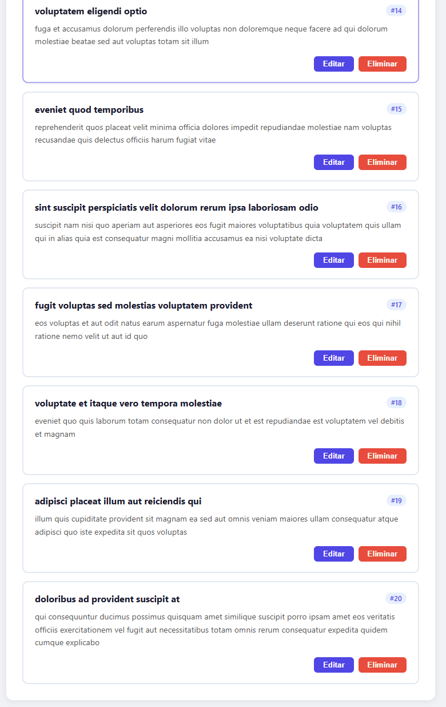
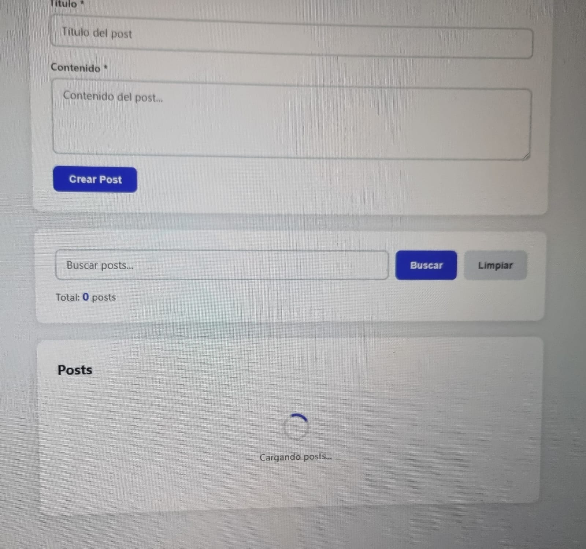
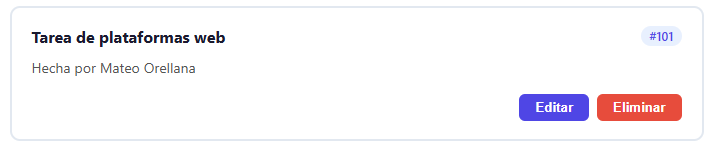
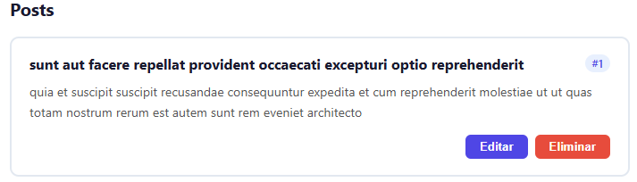
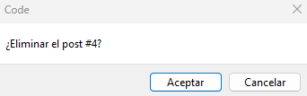
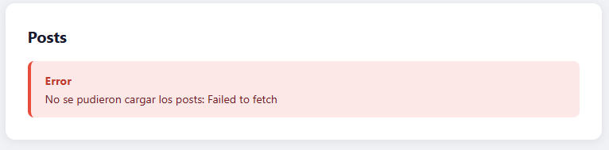
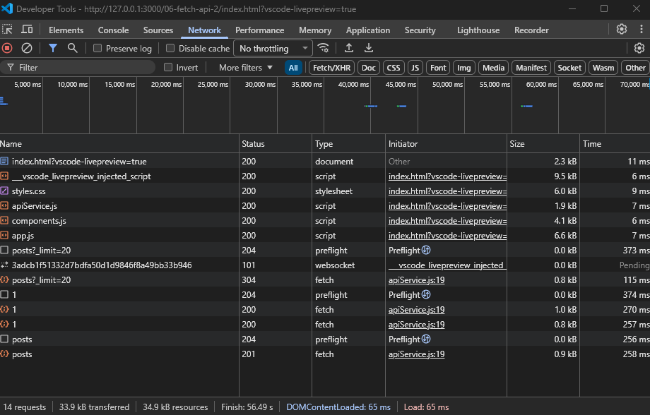

# Práctica 6 - Fetch API y CRUD REST

**Asignatura:** Programación y plataformas web
**Estudiante:** Mateo Orellana  
**Carrera:** Computación  
**Semestre:** 5° ciclo 
**Fecha:** 28 de Abril 2026   

---

## 1. Descripción de la solución

Esta práctica implementa un **Gestor de Posts** que consume la API pública
JSONPlaceholder para demostrar el uso completo de la Fetch API con operaciones
CRUD reales (GET, POST, PUT, DELETE).

La arquitectura está dividida en tres archivos JavaScript con responsabilidades
separadas. `apiService.js` centraliza todas las peticiones HTTP en un objeto
con un método genérico `request()` que valida `response.ok` y maneja errores.
`components.js` construye los elementos del DOM usando exclusivamente
`createElement` y `textContent`, evitando `innerHTML` con datos dinámicos para
prevenir vulnerabilidades XSS. `app.js` orquesta el estado de la aplicación,
conecta los eventos y coordina las funciones de los otros módulos.

La interfaz permite cargar posts con un spinner de carga, crear nuevos posts
via formulario, editarlos en modo edición, eliminarlos con confirmación, y
buscar por título o contenido en el cliente sin peticiones adicionales a la API.

---

## 2. Estructura del proyecto

practica-06/
├── index.html                  → Estructura HTML con las 3 secciones
├── css/
│   └── styles.css              → Estilos, tarjetas, spinner y mensajes
├── js/
│   ├── apiService.js           → Servicio HTTP con GET, POST, PUT, DELETE
│   ├── components.js           → Componentes DOM y funciones de renderizado
│   └── app.js                  → Estado, CRUD, búsqueda y event listeners
├── assets/
│   ├── 01-lista.png
│   ├── 02-spinner.png
│   ├── 03-crear.png
│   ├── 04-editar.png
│   ├── 05-eliminar.png
│   ├── 06-error.png
│   └── 07-network.png
└── README.md

---

## 3. Código destacado

### 3.1 Función que retorna una promesa con `fetch`

El método `request()` es el núcleo del servicio. Centraliza la configuración
de headers, verifica manualmente `response.ok` (porque `fetch` no lanza error
en respuestas 4xx/5xx), parsea el JSON y relanza el error para que las
funciones que lo llaman puedan capturarlo con `try/catch`.

```javascript
const ApiService = {
  baseUrl: 'https://jsonplaceholder.typicode.com',

  async request(endpoint, options = {}) {
    const url = `${this.baseUrl}${endpoint}`;
    const config = {
      headers: { 'Content-Type': 'application/json', ...options.headers },
      ...options
    };
    try {
      const response = await fetch(url, config);

      // fetch NO lanza error en 4xx/5xx — verificar manualmente
      if (!response.ok) {
        throw new Error(`HTTP Error: ${response.status} ${response.statusText}`);
      }
      if (response.status === 204) return null; // Sin body
      return await response.json();
    } catch (error) {
      console.error('Error en petición:', error);
      throw error; // Relanzar para que el caller lo capture
    }
  }
};
```

---

### 3.2 Operaciones CRUD completas

Cada método de `ApiService` llama a `request()` con el endpoint y las opciones
correspondientes. `POST` y `PUT` serializan el body con `JSON.stringify()`.
`DELETE` no necesita body.

```javascript
// GET - Obtener lista con límite
async getPosts(limit = 10) {
  return this.request(`/posts?_limit=${limit}`);
},

// POST - Crear nuevo post
async createPost(postData) {
  return this.request('/posts', {
    method: 'POST',
    body: JSON.stringify(postData)
  });
},

// PUT - Actualizar post existente
async updatePost(id, postData) {
  return this.request(`/posts/${id}`, {
    method: 'PUT',
    body: JSON.stringify(postData)
  });
},

// DELETE - Eliminar post
async deletePost(id) {
  return this.request(`/posts/${id}`, { method: 'DELETE' });
}
```

---

### 3.3 Componentes con la API del DOM (sin innerHTML)

En lugar de construir strings HTML, cada componente usa `createElement` para
crear elementos reales del DOM y `textContent` para asignar texto de forma
segura. Esto evita XSS y no destruye event listeners existentes.

```javascript
function PostCard(post) {
  const article = document.createElement('article');
  article.className = 'post-card fade-in';
  article.dataset.id = post.id;

  const title = document.createElement('h3');
  title.className = 'post-card-title';
  title.textContent = post.title; // Seguro: no interpreta HTML

  const body = document.createElement('p');
  body.className = 'post-card-body';
  body.textContent = post.body;

  const btnEditar = document.createElement('button');
  btnEditar.textContent = 'Editar';
  btnEditar.dataset.action = 'editar'; // Para event delegation
  btnEditar.dataset.id = post.id;

  // ... ensamblar con appendChild
  article.appendChild(title);
  article.appendChild(body);
  return article; // Retorna HTMLElement, no string
}
```

---

### 3.4 Manejo de errores con `try/catch`

La función `guardarPost()` deshabilita el botón mientras procesa, distingue
entre crear y actualizar según `modoEdicion`, y siempre restaura el botón en
el bloque `finally` para garantizar que la UI no quede bloqueada aunque
ocurra un error.

```javascript
async function guardarPost(datosPost) {
  try {
    btnSubmit.disabled    = true;
    btnSubmit.textContent = modoEdicion ? 'Actualizando...' : 'Creando...';

    let resultado;
    if (modoEdicion) {
      const id  = parseInt(inputPostId.value);
      resultado = await ApiService.updatePost(id, datosPost);
      // Actualizar en array local sin recargar desde la API
      const index = posts.findIndex(p => p.id === id);
      if (index !== -1) posts[index] = { ...resultado, id };
    } else {
      resultado = await ApiService.createPost(datosPost);
      posts.unshift(resultado); // Agregar al inicio del array
    }

    postsFiltrados = [...posts];
    renderizarPosts(postsFiltrados, listaPosts);
    actualizarContador();
    limpiarFormulario();

  } catch (error) {
    mostrarMensajeTemporal(mensajeEstado, MensajeError(`Error: ${error.message}`), 5000);
  } finally {
    btnSubmit.disabled    = false; // Siempre se ejecuta, con o sin error
    btnSubmit.textContent = modoEdicion ? 'Actualizar Post' : 'Crear Post';
  }
}
```

---

### 3.5 Event delegation para botones dinámicos

Un único listener en el contenedor padre maneja todos los clicks de los
botones Editar y Eliminar, incluyendo los de tarjetas creadas dinámicamente.
`data-action` identifica la acción y `data-id` identifica el post.

```javascript
listaPosts.addEventListener('click', (e) => {
  const action = e.target.dataset.action;
  if (!action) return; // Clic en área sin acción

  const id   = parseInt(e.target.dataset.id);
  const post = posts.find(p => p.id === id);

  if (action === 'editar' && post) activarModoEdicion(post);
  if (action === 'eliminar')      eliminarPost(id);
});
```

---

### 3.6 Búsqueda en el cliente sin peticiones adicionales

El filtrado se realiza sobre el array local `posts` sin hacer nuevas
peticiones a la API. Se busca el término tanto en el título como en el
body usando `includes()` con `toLowerCase()` para que sea insensible a
mayúsculas.

```javascript
function buscarPosts(termino) {
  const terminoLower = termino.toLowerCase().trim();

  if (terminoLower === '') {
    postsFiltrados = [...posts]; // Mostrar todos
  } else {
    postsFiltrados = posts.filter(post => {
      const tituloMatch = post.title.toLowerCase().includes(terminoLower);
      const bodyMatch   = post.body.toLowerCase().includes(terminoLower);
      return tituloMatch || bodyMatch; // Coincide en título O contenido
    });
  }

  renderizarPosts(postsFiltrados, listaPosts);
  actualizarContador();
}
```

---

## 4. Análisis técnico: Fetch API vs alternativas

| Aspecto | Fetch API | XMLHttpRequest | Axios |
|---|---|---|---|
| Sintaxis | `async/await` limpio | Callbacks anidados | `async/await` limpio |
| Errores 4xx/5xx | No lanza error automático | No lanza error | Lanza error automático |
| Instalación | Nativa del navegador | Nativa del navegador | Requiere librería |
| `response.ok` | Obligatorio verificar | Manual | Automático |

La decisión más importante al usar `fetch` es **siempre verificar `response.ok`**
antes de parsear la respuesta, ya que `fetch` solo lanza error en fallos de
red, no en respuestas HTTP con status 400, 404 o 500.

---

## 5. Capturas de pantalla

### 5.1 Lista de posts cargada desde la API

Se obtienen 20 posts desde JSONPlaceholder con una petición GET. Cada tarjeta
muestra el ID, título, contenido y botones de acción.



---

### 5.2 Spinner de carga

Estado visual mientras se espera la respuesta de la API. El spinner aparece
antes de que lleguen los datos y desaparece al renderizar las tarjetas.



---

### 5.3 Crear nuevo post

Formulario enviado con una petición POST. El mensaje verde confirma la
creación y el nuevo post aparece al inicio de la lista con su ID asignado.



---

### 5.4 Editar post existente

Al hacer clic en "Editar", el formulario se llena con los datos del post
seleccionado y el botón cambia a "Actualizar Post". Una petición PUT
envía los cambios a la API.



---

### 5.5 Eliminar post

Tras confirmar el diálogo, se envía una petición DELETE. El post desaparece
de la lista y el contador se actualiza automáticamente.



---

### 5.6 Manejo de error

Cuando la petición falla, el mensaje de error aparece en la interfaz sin
romper la aplicación. El error es capturado por `try/catch` y nunca queda
solo en la consola.



---

### 5.7 DevTools — Pestaña Network

Se observan las peticiones HTTP con sus métodos, endpoints y status codes:
GET 200, POST 201, PUT 200, DELETE 200.



---

## 6. Conclusiones

- `fetch` no lanza error en respuestas 4xx/5xx, por eso es obligatorio
  verificar `response.ok` después de cada petición.
- Separar el código en `apiService.js`, `components.js` y `app.js` mejora
  la legibilidad y hace que cada archivo tenga una única responsabilidad.
- Usar `createElement` y `textContent` en lugar de `innerHTML` con datos
  dinámicos es una práctica de seguridad fundamental para prevenir XSS.
- El bloque `finally` garantiza que la UI siempre se restaura al estado
  correcto, independientemente de si la operación tuvo éxito o falló.
- Event delegation con `data-action` permite manejar clicks en elementos
  creados dinámicamente con un único listener, lo que es más eficiente y
  evita fugas de memoria.
- Filtrar en el cliente evita peticiones innecesarias a la API cuando los
  datos ya están disponibles en memoria.