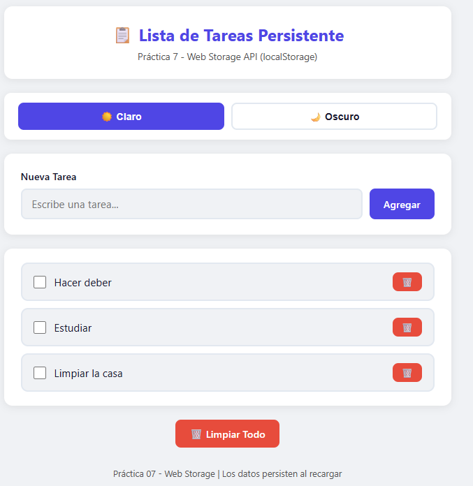
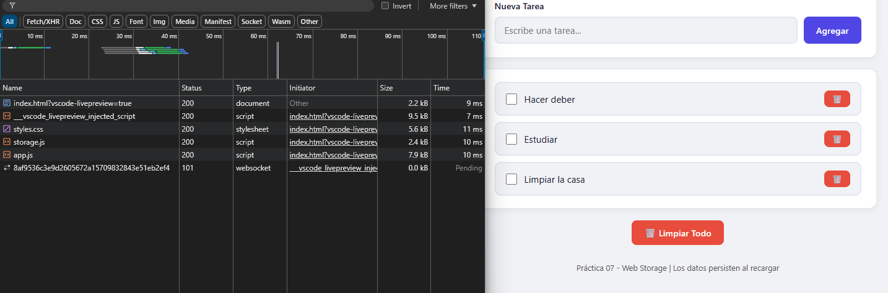
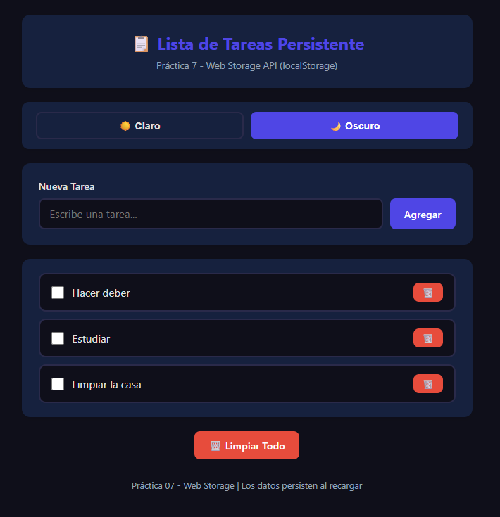
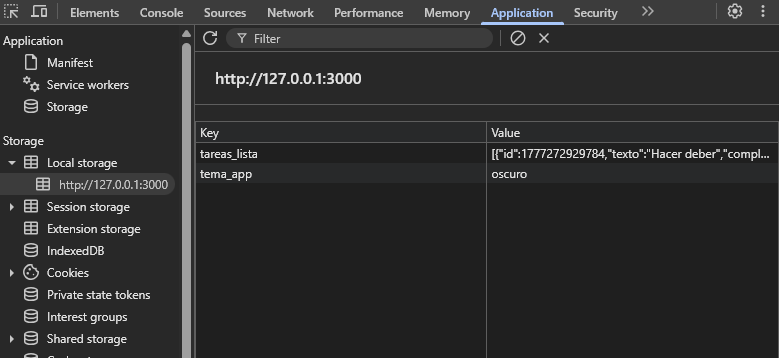

# Práctica 7 - Web Storage API

**Asignatura:** Programación y plataformas web
**Estudiante:** Mateo Orellana  
**Carrera:** Computación  
**Semestre:** 5° ciclo 
**Fecha:** 28 de Abril 2026   

---

## 1. Descripción de la solución

Esta práctica implementa una **Lista de Tareas Persistente** usando la Web
Storage API del navegador, específicamente `localStorage`, sin frameworks
ni librerías externas.

La arquitectura separa las responsabilidades en dos archivos JavaScript.
`storage.js` contiene dos servicios: `TareaStorage`, que encapsula todas
las operaciones de lectura y escritura de tareas en `localStorage` usando
`JSON.stringify` y `JSON.parse`, y `TemaStorage`, que persiste la preferencia
de tema del usuario. `app.js` maneja el estado en memoria, construye los
elementos del DOM con `createElement` y coordina los eventos de la interfaz.

La aplicación permite agregar, completar y eliminar tareas, cambiar entre
tema claro y oscuro, y limpiar toda la lista. Todos los datos persisten al
recargar la página porque se leen desde `localStorage` en la inicialización.

---

## 2. Estructura del proyecto

practica-07/
├── index.html              → Estructura HTML de la aplicación
├── css/
│   └── styles.css          → Estilos con CSS Variables para los temas
├── js/
│   ├── storage.js          → Servicios TareaStorage y TemaStorage
│   └── app.js              → Lógica, renderizado y eventos
├── assets/
│   ├── 01-lista.png
│   ├── 02-persistencia.png
│   ├── 03-tema-oscuro.png
│   └── 04-devtools.png
└── README.md

---

## 3. Código destacado

### 3.1 Servicio de Storage centralizado

El objeto `TareaStorage` encapsula toda la lógica de `localStorage`. Esto
evita repetir `JSON.stringify`/`JSON.parse` en cada parte del código y
centraliza el manejo de errores en un solo lugar con `try/catch`.

```javascript
const TareaStorage = {
  CLAVE: 'tareas_lista',

  getAll() {
    try {
      const datos = localStorage.getItem(this.CLAVE);
      if (!datos) return []; // getItem retorna null si no existe
      return JSON.parse(datos);
    } catch (error) {
      console.error('Error al leer tareas:', error);
      return [];
    }
  },

  guardar(tareas) {
    try {
      localStorage.setItem(this.CLAVE, JSON.stringify(tareas));
    } catch (error) {
      console.error('Error al guardar tareas:', error);
    }
  }
};
```

El patrón de verificar `if (!datos)` antes de parsear es fundamental porque
`localStorage.getItem()` retorna `null` cuando la clave no existe, y aunque
`JSON.parse(null)` no lanza error, es mejor retornar directamente un array
vacío para mayor claridad.

---

### 3.2 Métodos CRUD del servicio

Cada operación sigue el mismo patrón: leer el array completo, modificarlo
en memoria y guardarlo de vuelta. Esto garantiza que `localStorage` siempre
tenga el estado más reciente.

```javascript
// Crear nueva tarea
crear(texto) {
  const tareas = this.getAll();
  const nueva  = {
    id:         Date.now(), // ID único basado en timestamp
    texto:      texto.trim(),
    completada: false
  };
  tareas.push(nueva);
  this.guardar(tareas);
  return nueva;
},

// Alternar estado completada/pendiente
toggleCompletada(id) {
  const tareas = this.getAll();
  const tarea  = tareas.find(t => t.id === id);
  if (tarea) {
    tarea.completada = !tarea.completada; // Invierte el estado
  }
  this.guardar(tareas);
},

// Eliminar por ID
eliminar(id) {
  const tareas    = this.getAll();
  const filtradas = tareas.filter(t => t.id !== id);
  this.guardar(filtradas);
},

// Eliminar la clave completa
limpiarTodo() {
  localStorage.removeItem(this.CLAVE);
}
```

---

### 3.3 Construcción de elementos con `createElement`

Cada tarea se construye con la API del DOM en lugar de `innerHTML`. Esto
previene vulnerabilidades XSS porque `textContent` escapa automáticamente
cualquier carácter HTML que pudiera estar en el texto de la tarea.

```javascript
function crearElementoTarea(tarea) {
  const li       = document.createElement('li');
  li.className   = 'task-item';
  li.dataset.id  = tarea.id;

  if (tarea.completada) li.classList.add('task-item--completed');

  const checkbox     = document.createElement('input');
  checkbox.type      = 'checkbox';
  checkbox.className = 'task-item__checkbox';
  checkbox.checked   = tarea.completada;

  const span       = document.createElement('span');
  span.className   = 'task-item__text';
  span.textContent = tarea.texto; // Seguro: nunca usa innerHTML con datos

  const btnEliminar       = document.createElement('button');
  btnEliminar.className   = 'btn btn--danger btn--small';
  btnEliminar.textContent = '🗑️';

  const divAcciones     = document.createElement('div');
  divAcciones.className = 'task-item__actions';
  divAcciones.appendChild(btnEliminar);

  li.appendChild(checkbox);
  li.appendChild(span);
  li.appendChild(divAcciones);

  // Event listeners directamente en los elementos creados
  checkbox.addEventListener('change', () => toggleTarea(tarea.id));
  btnEliminar.addEventListener('click', () => eliminarTarea(tarea.id));

  return li;
}
```

---

### 3.4 Persistencia de tema con CSS Variables

El tema se aplica modificando las variables CSS del elemento raíz
`:root` con `setProperty`. Esto actualiza toda la interfaz
instantáneamente sin recargar ni reescribir clases en cada elemento.

```javascript
function aplicarTema(nombreTema) {
  if (nombreTema === 'oscuro') {
    document.documentElement.style.setProperty('--bg-primary',  '#0f0f1a');
    document.documentElement.style.setProperty('--card-bg',     '#16213e');
    document.documentElement.style.setProperty('--text-primary','#e0e0e0');
    // ... más variables
  } else {
    document.documentElement.style.setProperty('--bg-primary',  '#f0f2f5');
    document.documentElement.style.setProperty('--card-bg',     '#ffffff');
    document.documentElement.style.setProperty('--text-primary','#1a1a2e');
    // ... más variables
  }

  // Marcar el botón activo
  themeBtns.forEach(btn => {
    btn.classList.toggle('theme-btn--active', btn.dataset.theme === nombreTema);
  });

  // Guardar preferencia
  TemaStorage.setTema(nombreTema);
}
```

---

### 3.5 Inicialización con datos persistentes

Al cargar la página se leen los datos guardados antes de renderizar,
lo que garantiza que el usuario siempre vea su estado anterior.

```javascript
// Restaurar tema guardado
const temaGuardado = TemaStorage.getTema();
aplicarTema(temaGuardado);

// Cargar tareas desde localStorage
function cargarTareas() {
  tareas = TareaStorage.getAll();
  renderizarTareas();
}
cargarTareas();

// Bienvenida solo si no hay tareas previas
if (tareas.length === 0) {
  mostrarMensaje('👋 ¡Bienvenido! Agrega tu primera tarea', 'success');
}
```

---

## 4. Análisis: localStorage vs sessionStorage

| Característica | localStorage | sessionStorage |
|---|---|---|
| Duración | Permanente | Solo la sesión |
| Alcance | Todas las pestañas | Solo la pestaña actual |
| Capacidad | ~5-10 MB | ~5 MB |
| API | Idéntica | Idéntica |
| Uso ideal | Preferencias, datos del usuario | Formularios temporales |

En esta práctica se usa `localStorage` porque los datos deben persistir
entre sesiones y pestañas. Si se usara `sessionStorage`, las tareas
desaparecerían al cerrar el navegador.

---

## 5. Capturas de pantalla

### 5.1 Lista con datos creados

Varias tareas agregadas, algunas marcadas como completadas con texto
tachado. Cada tarea tiene su checkbox y botón de eliminar.



---

### 5.2 Persistencia al recargar

Las mismas tareas siguen apareciendo después de recargar la página
con `F5`. Los datos se recuperan automáticamente desde `localStorage`
al inicializar la aplicación.



---

### 5.3 Tema oscuro aplicado

Al hacer clic en "🌙 Oscuro", las variables CSS cambian instantáneamente.
Al recargar la página, el tema se restaura porque se guardó en
`localStorage` con la clave `tema_app`.



---

### 5.4 DevTools — Application → Local Storage

En la pestaña Application de DevTools se observan las dos claves
guardadas: `tareas_lista` con el array de tareas serializado en JSON
y `tema_app` con el nombre del tema activo.



---

## 6. Conclusiones

- `localStorage` permite persistir datos entre sesiones sin necesidad
  de un servidor ni base de datos, usando solo el navegador.
- Es obligatorio verificar que `localStorage.getItem()` no retorne
  `null` antes de usar `JSON.parse`, ya que retorna `null` cuando la
  clave no existe.
- Centralizar las operaciones de Storage en un servicio separado evita
  repetir `JSON.stringify`/`JSON.parse` y facilita el manejo de errores.
- Las CSS Variables permiten cambiar el tema completo de la aplicación
  modificando solo unas pocas propiedades en el elemento raíz, sin
  tocar el HTML ni agregar clases a cada elemento.
- Usar `createElement` y `textContent` en lugar de `innerHTML` con
  datos del usuario es una práctica de seguridad que previene ataques XSS.
- `Date.now()` genera IDs únicos basados en el timestamp actual, lo
  que es suficiente para aplicaciones de cliente donde no hay concurrencia.