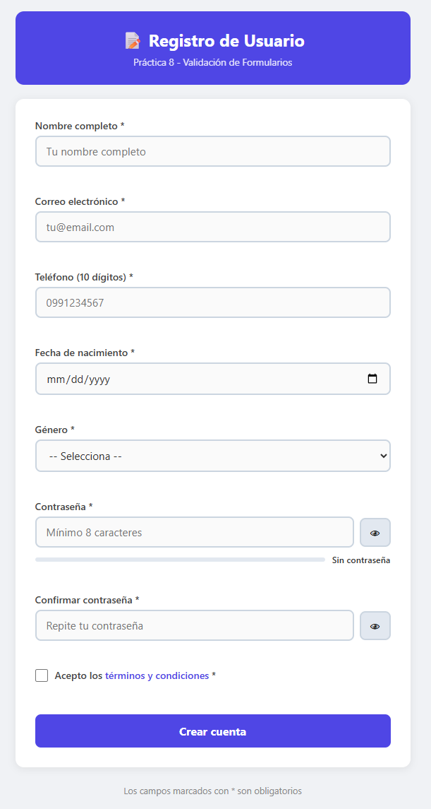
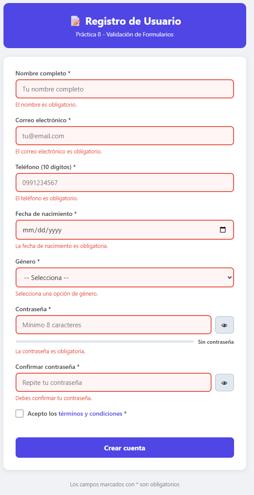
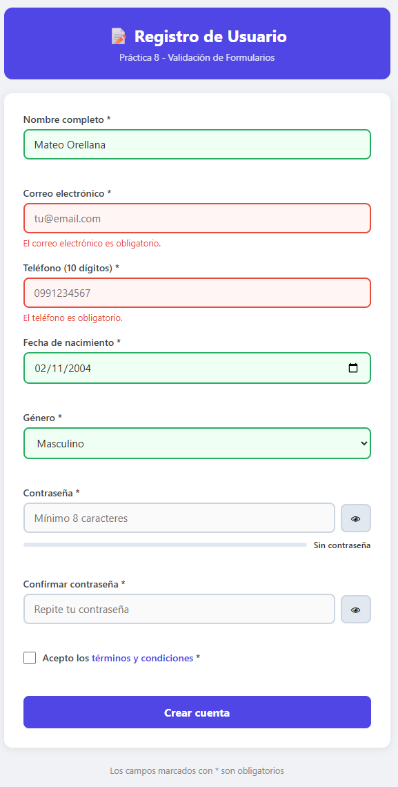
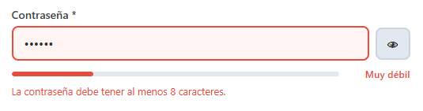
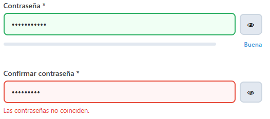
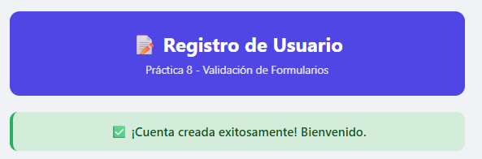
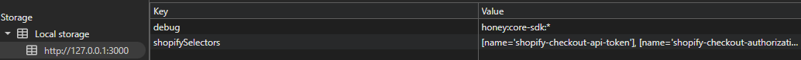

# Práctica 8 - Validación de Formularios

**Asignatura:** Programación y plataformas web
**Estudiante:** Mateo Orellana  
**Carrera:** Computación  
**Semestre:** 5° ciclo 
**Fecha:** 28 de Abril 2026

---

## 1. Descripción de la solución

Esta práctica implementa un **formulario de registro** con validación completa
en JavaScript puro, sin frameworks ni librerías externas.

El formulario cuenta con 8 campos obligatorios: nombre, correo electrónico,
teléfono, fecha de nacimiento, género, contraseña, confirmación de contraseña
y aceptación de términos. La validación se maneja íntegramente con JavaScript
usando el atributo `novalidate` en el formulario para desactivar la validación
nativa del navegador.

La arquitectura divide las responsabilidades en dos archivos. `validacion.js`
contiene las funciones de validación, las expresiones regulares y el control
del indicador de fuerza de contraseña. `app.js` gestiona los eventos, las
funcionalidades extra y el envío del formulario.

Las funcionalidades extra implementadas son: máscara de teléfono que solo
permite dígitos, autoguardado del formulario en `sessionStorage` para no
perder datos al recargar, y botón para mostrar u ocultar la contraseña.

---

## 2. Estructura del proyecto
practica-08/
├── index.html              → Formulario con 8 campos y novalidate
├── css/
│   └── styles.css          → Estilos, estados de validación y fuerza
├── js/
│   ├── validacion.js       → Funciones de validación y regex
│   └── app.js              → Eventos, autoguardado y envío
├── assets/
│   ├── 01-formulario-vacio.png
│   ├── 02-errores.png
│   ├── 03-validos.png
│   ├── 04-fuerza-password.png
│   ├── 05-passwords-no-coinciden.png
│   ├── 06-envio-exitoso.png
│   └── 07-autoguardado.png
└── README.md

---

## 3. Código destacado

### 3.1 Expresiones regulares personalizadas

Se definen tres regex para validar formato de email, teléfono de 10 dígitos
y contraseña segura. El método `.test()` retorna `true` o `false` y se usa
dentro de cada validador para verificar el formato.

```javascript
const REGEX = {
  email:    /^[^\s@]+@[^\s@]+\.[^\s@]+$/,
  telefono: /^\d{10}$/,
  password: /^(?=.*[a-z])(?=.*[A-Z])(?=.*\d).{8,}$/,
  nombre:   /^[a-zA-ZáéíóúÁÉÍÓÚñÑ\s]{3,50}$/
};
```

La regex de contraseña usa lookaheads: `(?=.*[a-z])` verifica que exista al
menos una minúscula, `(?=.*[A-Z])` una mayúscula y `(?=.*\d)` un número,
todo esto antes de comprobar que la longitud sea de 8 o más caracteres.

---

### 3.2 Función `validarCampo()` con mensajes específicos

La función recibe el elemento del campo, extrae su `id` y usa un `switch`
para aplicar reglas específicas a cada campo. Retorna `true` si es válido
o `false` si tiene error, y aplica el estado visual correspondiente.

```javascript
function validarCampo(campo) {
  const id    = campo.id;
  const valor = campo.value.trim();
  let error   = '';

  switch (id) {
    case 'nombre':
      if (!valor) {
        error = 'El nombre es obligatorio.';
      } else if (valor.length < 3) {
        error = 'El nombre debe tener al menos 3 caracteres.';
      } else if (!REGEX.nombre.test(valor)) {
        error = 'El nombre solo puede contener letras y espacios.';
      }
      break;

    case 'email':
      if (!valor) {
        error = 'El correo electrónico es obligatorio.';
      } else if (!REGEX.email.test(valor)) {
        error = 'Ingresa un correo electrónico válido (ej: tu@email.com).';
      }
      break;

    case 'fecha-nacimiento':
      if (!valor) {
        error = 'La fecha de nacimiento es obligatoria.';
      } else {
        const hoy      = new Date();
        const nacido   = new Date(valor);
        const edad     = hoy.getFullYear() - nacido.getFullYear();
        const cumple   = new Date(hoy.getFullYear(), nacido.getMonth(), nacido.getDate());
        const edadReal = cumple <= hoy ? edad : edad - 1;
        if (edadReal < 18) {
          error = 'Debes ser mayor de 18 años para registrarte.';
        }
      }
      break;

    case 'confirmar-password': {
      const pass = document.getElementById('password').value;
      if (!valor) {
        error = 'Debes confirmar tu contraseña.';
      } else if (valor !== pass) {
        error = 'Las contraseñas no coinciden.';
      }
      break;
    }
    // ... otros casos
  }

  mostrarEstadoCampo(campo, error);
  return error === '';
}
```

---

### 3.3 Feedback visual en tiempo real

Se usan dos eventos sobre el formulario completo con delegación. `focusout`
burbujea desde cada campo hasta el form y dispara la validación al salir
del campo. `input` limpia el error mientras el usuario escribe para no
bloquear la experiencia.

```javascript
// Validar al perder foco (focusout burbujea, blur no)
form.addEventListener('focusout', (e) => {
  const campo = e.target;
  if (campo.tagName === 'INPUT' || campo.tagName === 'SELECT') {
    if (campo.type !== 'hidden') validarCampo(campo);
  }
});

// Limpiar error al empezar a escribir
form.addEventListener('input', (e) => {
  const campo = e.target;
  if (campo.tagName === 'INPUT' && campo.type !== 'checkbox') {
    limpiarErrorCampo(campo);
    autoguardar(); // También autoguarda
  }
});
```

El estado visual se aplica con clases CSS `.valido` e `.invalido` que
cambian el borde y el fondo del campo:

```javascript
function mostrarEstadoCampo(campo, error) {
  const errorEl = document.getElementById(`error-${campo.id}`);
  if (error) {
    campo.classList.remove('valido');
    campo.classList.add('invalido');
    if (errorEl) errorEl.textContent = error;
  } else {
    campo.classList.remove('invalido');
    if (campo.type !== 'checkbox') campo.classList.add('valido');
    if (errorEl) errorEl.textContent = '';
  }
}
```

---

### 3.4 Indicador de fuerza de contraseña

La función `calcularFuerza()` suma puntos según criterios de seguridad:
longitud mínima, longitud extendida, mayúsculas, minúsculas, números y
caracteres especiales. El resultado determina el nivel visual del indicador.

```javascript
function calcularFuerza(password) {
  let puntos = 0;

  if (password.length >= 8)            puntos++;
  if (password.length >= 12)           puntos++;
  if (/[A-Z]/.test(password))         puntos++;
  if (/[a-z]/.test(password))         puntos++;
  if (/\d/.test(password))            puntos++;
  if (/[^a-zA-Z0-9]/.test(password)) puntos++;

  if (puntos <= 1) return { texto: 'Muy débil', clase: 'debil'   };
  if (puntos <= 3) return { texto: 'Regular',   clase: 'regular' };
  if (puntos <= 4) return { texto: 'Buena',     clase: 'buena'   };
  return            { texto: 'Fuerte',    clase: 'fuerte'  };
}
```

---

### 3.5 Envío con `FormData` y `preventDefault()`

El evento `submit` primero previene el comportamiento nativo, luego valida
todos los campos. Si todo es correcto, recopila los datos con `FormData`
y `Object.fromEntries`, maneja el checkbox manualmente y resetea el formulario.

```javascript
form.addEventListener('submit', (e) => {
  e.preventDefault(); // Obligatorio

  const esValido = validarFormulario(form);

  if (!esValido) {
    mostrarMensaje('⚠️ Corrige los errores antes de continuar.', 'error');
    const primerError = form.querySelector('.invalido');
    if (primerError) primerError.scrollIntoView({ behavior: 'smooth' });
    return;
  }

  // FormData solo captura campos con atributo name
  const formData = new FormData(form);
  const datos    = Object.fromEntries(formData);

  // Checkbox no marcado no aparece en FormData — manejar manualmente
  datos.terminos = form.querySelector('[name="terminos"]').checked;

  console.log('📋 Datos del formulario:', datos);
  mostrarMensaje('✅ ¡Cuenta creada exitosamente!', 'exito');
  form.reset();
  sessionStorage.removeItem(STORAGE_KEY);
});
```

---

### 3.6 Funcionalidades extra implementadas

**Máscara de teléfono:** filtra cualquier carácter que no sea dígito en
tiempo real, garantizando que solo se puedan escribir los 10 números.

```javascript
inputTelefono.addEventListener('input', () => {
  inputTelefono.value = inputTelefono.value.replace(/\D/g, '').slice(0, 10);
});
```

**Autoguardado en `sessionStorage`:** cada vez que el usuario escribe,
los datos del formulario se guardan. Al recargar la página se restauran
automáticamente para no perder el progreso.

```javascript
function autoguardar() {
  const datos = {
    nombre:  document.getElementById('nombre').value,
    email:   document.getElementById('email').value,
    telefono: document.getElementById('telefono').value,
    // ...
  };
  sessionStorage.setItem(STORAGE_KEY, JSON.stringify(datos));
}

function restaurarBorrador() {
  const guardado = sessionStorage.getItem(STORAGE_KEY);
  if (!guardado) return;
  const datos = JSON.parse(guardado);
  if (datos.nombre) document.getElementById('nombre').value = datos.nombre;
  // ...
}
```

---

## 4. Capturas de pantalla

### 4.1 Formulario vacío

Vista inicial del formulario al cargar la página, sin datos ni estados
de validación aplicados.



---

### 4.2 Errores de validación

Varios campos con borde rojo y mensajes de error específicos debajo de
cada uno, mostrando que cada campo tiene su propio mensaje descriptivo.



---

### 4.3 Campos válidos

Campos correctamente llenados con borde verde, confirmando que la
validación fue exitosa para cada uno.



---

### 4.4 Indicador de fuerza de contraseña

El indicador cambia de color y texto según la seguridad de la contraseña:
rojo para muy débil, amarillo para regular, azul para buena y verde para fuerte.



---

### 4.5 Contraseñas que no coinciden

Error específico cuando el campo de confirmación no coincide con la
contraseña original.



---

### 4.6 Envío exitoso

Mensaje verde confirmando el registro exitoso. El formulario se resetea
completamente y los datos se muestran en la consola del navegador.



---

### 4.7 Autoguardado en sessionStorage

DevTools → Application → Session Storage mostrando los datos del
formulario guardados automáticamente mientras el usuario escribe.



---

## 5. Conclusiones

- El atributo `novalidate` desactiva la validación nativa del navegador,
  permitiendo controlar completamente los mensajes y estilos de error.
- `focusout` es preferible a `blur` para delegación de eventos porque
  `focusout` burbujea hasta el elemento padre mientras `blur` no lo hace.
- Las expresiones regulares con `lookaheads` permiten validar múltiples
  condiciones en una sola regex, como la contraseña segura.
- `FormData` con `Object.fromEntries` simplifica la recopilación de datos
  del formulario, pero los checkboxes no marcados no se incluyen y deben
  verificarse manualmente con `.checked`.
- El autoguardado en `sessionStorage` mejora la experiencia del usuario
  al preservar su progreso si recarga accidentalmente la página.
- Mostrar errores específicos por tipo de fallo ("debe tener al menos
  una mayúscula" en lugar de "contraseña inválida") reduce la fricción
  del usuario al corregir sus datos.